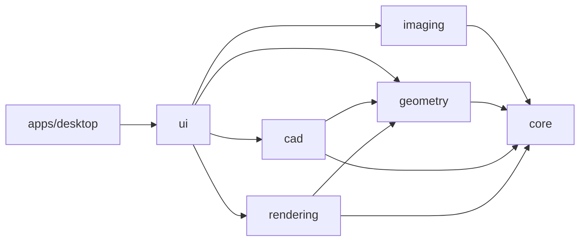

# Current module diagram

Patient coordinates are LPS millimeters. Open CASCADE types stay inside `cad`. VTK types stay inside `rendering`.

```mermaid
flowchart LR
  apps["apps/desktop"] --> ui
  ui --> cad
  ui --> rendering
  ui --> imaging
  ui --> geometry
  cad --> geometry
  rendering --> geometry
  imaging --> core
  geometry --> core
  cad --> core
  rendering --> core
```
